# AI Code Review 系统是怎么跑起来的

> 写给不了解背景的同事，帮你在 10 分钟内搞清楚这套东西做了什么、怎么做的。

## 一句话说清楚

我们在 GitHub 上接入了 Codex 和 Claude Code，让它们像团队成员一样自动帮忙干活：PR 提上去由 Codex 优先审代码，Codex 失败时 Claude Code 自动接手；Issue 建出来仍可自动分析，评论里喊一声 `/impl` 还能直接写代码交 PR。

本文主要讲 **Code Review** 这部分。

---

## 先看效果

一个典型的流程：

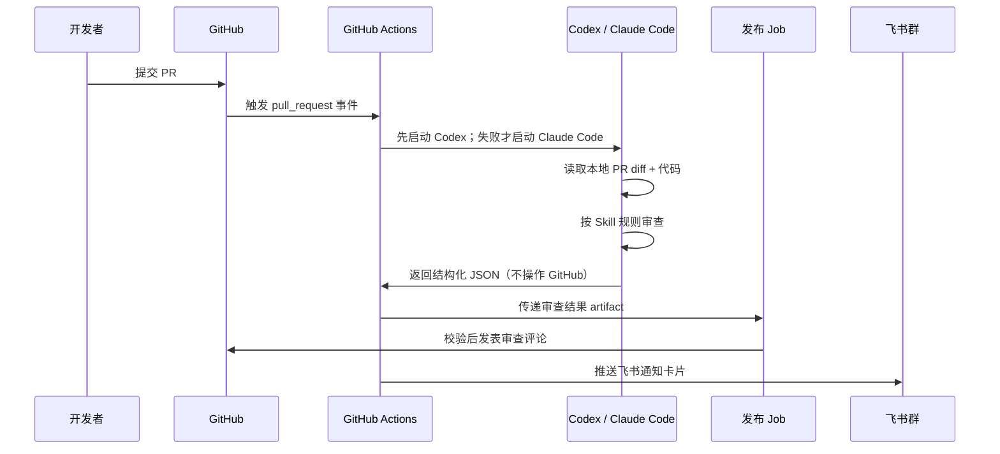

你不需要 @任何人，不需要手动操作，PR 一提就自动跑。

---

## 整体架构

系统分两层：**模板仓库**（提供能力）和 **业务仓库**（使用能力）。

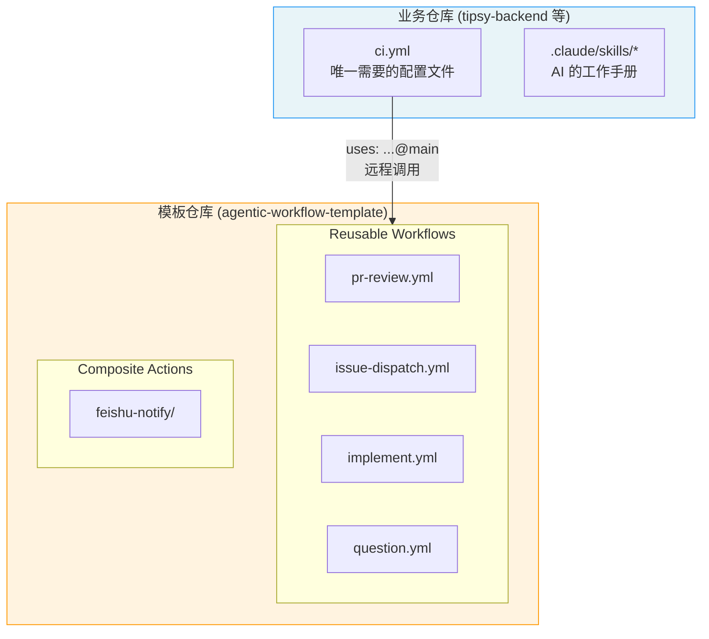

为什么这么拆？因为你不想在每个仓库里都维护一套 workflow。**模板仓库改一次，所有接入的业务仓库立刻生效。**

业务仓库只需要做两件事：
1. 放一个 `ci.yml` 当路由入口
2. 放一套 `.claude/skills/` 告诉 AI 该怎么干活

---

## 事件路由：ci.yml 做了什么

`ci.yml` 是整个系统的入口——**根据 GitHub 事件类型，分发到不同的 workflow**：

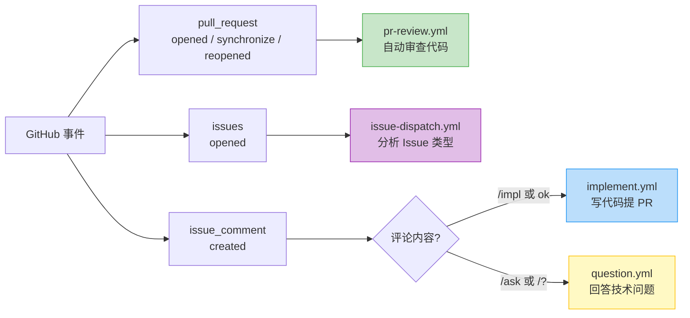

对应的路由逻辑：

```yaml
# PR 事件 → 代码审查
pr-review:
  if: github.event_name == 'pull_request'

# Issue 新建 → 自动分析（Bug? 需求? 问题?）
issue-dispatch:
  if: github.event_name == 'issues'

# Issue 下评论 → 看关键词决定干什么
implement:
  if: github.event_name == 'issue_comment'  # 匹配 /impl, ok 等
question:
  if: github.event_name == 'issue_comment'  # 匹配 /ask, /? 等
```

---

## Code Review 的详细流程

这是本文重点。当一个非 Draft 的 PR 被 opened / synchronize / reopened 时，审查流程启动：

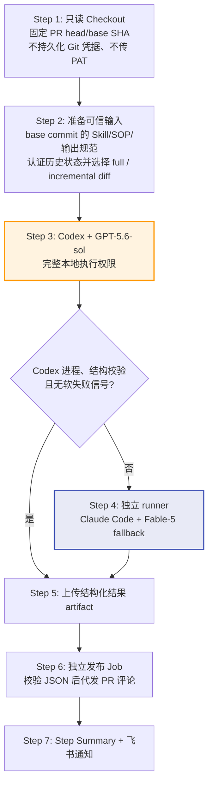

其中 **Step 3/4** 是 Agent 实际干活的地方，内部逻辑如下：

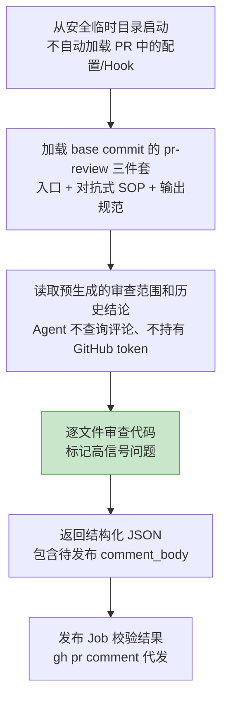

两个 Agent 的权限分成“本地运行环境”和“GitHub 仓库资源”两层：

| 能力 | Agent 权限 | 说明 |
|------|------------|------|
| 本地 Shell / 文件 / 测试工具 | 完整 | runner 是一次性环境，可自由构建、测试和分析 |
| PR head checkout | 本地可读写 | 仅影响临时 runner，不会写回仓库 |
| GitHub contents / pull requests | job token 只读 | token 仅供 checkout 和输入准备步骤使用 |
| `gh pr comment` 等写操作 | 无 | Agent 进程不接收 GitHub token 或 PAT |
| 发布审查评论 | 独立发布 Job | 唯一拥有 `pull-requests: write` 的非 Agent job |

Agent 可以修改临时工作区，但既没有可持久化的 Git 凭据，也没有 GitHub 写 token，因此不能把影响推回仓库。

Codex 使用完整本地权限时会绕过其内置 bubblewrap：GitHub 托管 runner 可能无法让
bubblewrap 配置 loopback，导致沙箱初始化先于审查失败。这里不把本地沙箱当作 GitHub
安全边界；真正的边界是独立 runner、只读 job token、无持久化凭据和单独发布 Job。
Claude fallback 也拥有完整本地权限；可选 `extra_allowed_tools` 仅声明仓库子目录中的
只读 Git 工具模式，经过 allowlist 校验，不会扩大 GitHub 权限。

---

## 为什么只对少量小问题做增量

增量审查可以减少重复工作，但不能让 Agent 自己从自由文本评论推断截止点。publisher
会在审查评论末尾追加由确定性代码生成的结构化状态标记；下一次运行的准备步骤使用
job 的只读 token 读取评论，只接受 `github-actions` App 发布的最后一个合法标记，并验证
字段类型、计数和历史 head 对当前 head 的祖先关系。原评论正文作为不可信数据写入
`review-history.json`，token 不会传给 Agent。

只有上一轮没有 BLOCKER/MAJOR、恰有 1–3 个 MINOR/NIT 时，准备步骤才生成
`cutoff..head` 增量 diff。reviewer 必须先逐条验证旧问题，再结合当前完整 checkout
检查回归。上一轮已通过、存在重要问题、超过三个小问题、状态缺失/伪造/过期，或 ancestry
不成立时，全部回退到完整 `base...head`。这既避免小修复被反复全量挖问题，也不让评论
成为未经校验的安全边界。

上述控制流由 `scripts/test-pr-review-contract.py` 的离线真值表覆盖，并由 CI 的
`pr-review-contract` job 在每个 PR 上运行。测试直接调用 workflow 使用的 base-pinned
历史准备脚本，同时验证 schema、publisher gate、fallback/artifact 条件和工具 allowlist，
避免实现与临时 `.code-review/` fixture 漂移。

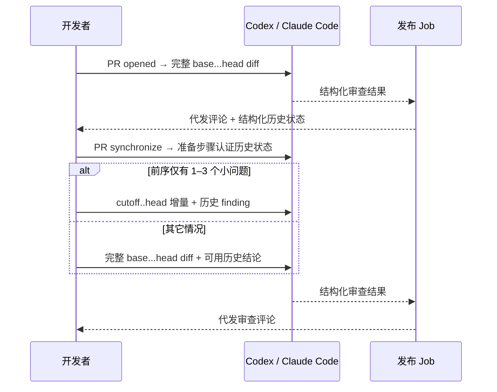

---

## Skill 系统：AI 的"工作手册"

Agent 的审查行为受 `.claude/skills/` 目录下的 Markdown 文件约束。为避免 PR 自己篡改规则，审查 workflow 固定从 base commit 读取 Skill；可以把 Skill 理解成给 AI 写的 SOP（标准作业流程）。

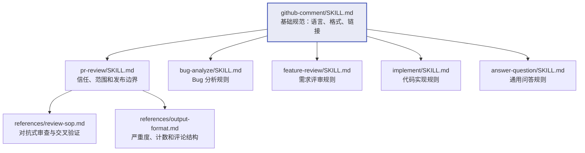

`pr-review` 三件套把信任/发布边界、具体审查方法和输出契约分开维护。入口要求严格
遵循 workflow 认证的 full/incremental 范围并核对历史 finding，SOP 负责风险分级和
代码/文档/可观测性的对抗式交叉验证，输出规范负责 finding 严重度与结构化计数一致。

以 `pr-review` Skill 为例，它规定了几件事：

**该标记的（高信号问题）：**
- 语法错误、类型错误、缺少 import
- 不管输入是什么都一定会出错的逻辑 bug
- 违反了某个明确规范（且能引用该规范）

**不该标记的（误报来源）：**
- PR 改动前就存在的老问题
- "有可能出问题"但需要特定条件才会触发的
- 主观的"我觉得这样写更好"
- Linter 已经能抓的

一句话原则：**拿不准就别标。误报一多，大家就不看了。**

输出模板也是固定的——三级问题用折叠块展示：

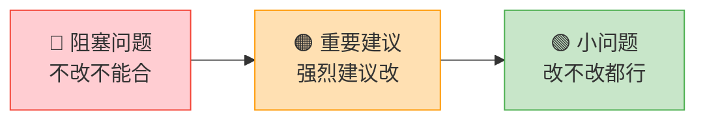

---

## 结构化输出：JSON 驱动下游

Agent 的审查结果是一份结构化 JSON，评论正文也只是其中的待发布数据：

```json
{
  "review_status": "COMPLETE",
  "conclusion": "COMMENT",
  "description": "代码良好，发现 2 个小问题",
  "critical_count": 0,
  "important_count": 0,
  "suggestion_count": 2,
  "comment_body": "## PR 审查……",
  "reviewer": "codex",
  "model": "gpt-5.6-sol"
}
```

这个 JSON 通过 CLI 的 JSON Schema 参数约束，并在发布 Job 中再次用 `jq` 校验完成状态、枚举、计数、正文长度和 reviewer/model 组合。只有 `review_status=COMPLETE` 的结果才允许评论和通知步骤消费；`INCOMPLETE` 即使伴随退出码 0 也会触发 fallback 或使最终审查失败。

Agent artifact 内含 `comment_body`；reusable workflow 的公开 `structured_output` 会删除正文，但保留 `reviewer` 和 `model`，便于调用方判断实际使用的主链路或 fallback。

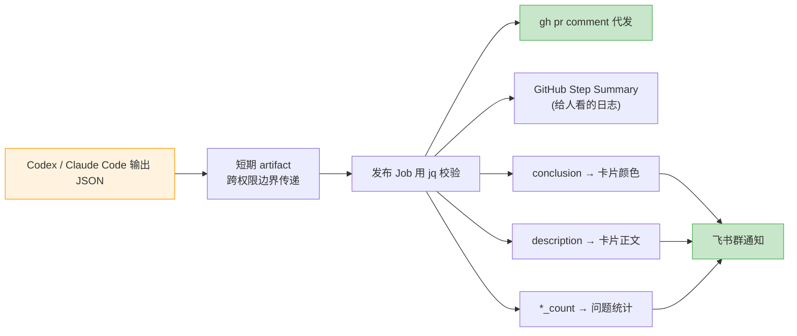

---

## 飞书通知

飞书通知根据状态拼一张卡片 JSON，再用 curl 发到 Webhook。PR review 为避免高权限发布 job 动态加载可变代码，直接内联已审计的通知逻辑；其它 workflow 仍可复用 `feishu-notify` Composite Action。所有不可信文本都先经 `env` 传入 shell，再由 `jq --arg` 编码：

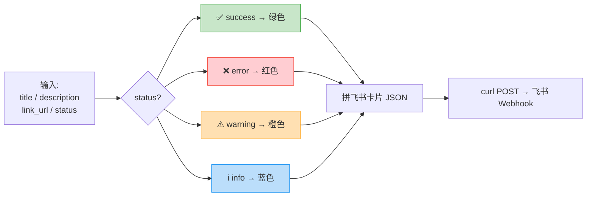

---

## 权限和安全

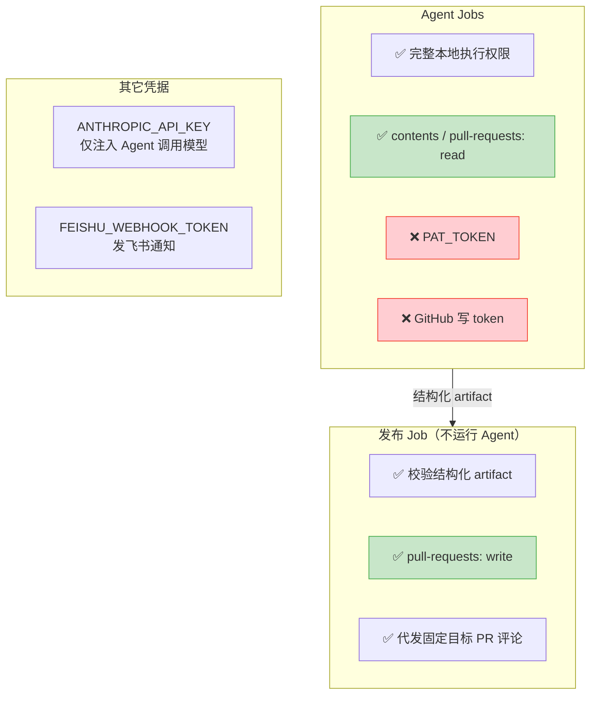

**Agent 对 runner 是高权限的，对 GitHub 仓库资源是只读的。** 即使 Agent 修改了临时 checkout，也没有凭据推送；评论等外部副作用只能经过独立发布 Job。

---

## 新仓库接入清单

给一个新仓库接入这套能力，只需要三步：

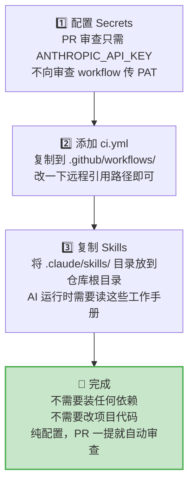

---

## 不只是 Code Review

虽然本文聚焦 Code Review，但同一套架构还支撑了其他几个能力：

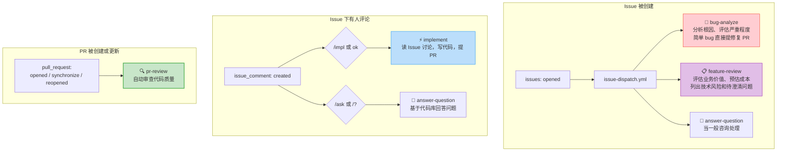

---

## 总结

几个关键的设计决策：

- **模板仓库 + Reusable Workflow** — 改一处，全局生效，多仓库接入成本极低
- **Skill = Markdown SOP** — AI 的行为规则以 Markdown 定义，任何人都能读懂和修改
- **完整范围优先、可信小增量** — 仅经认证的 1–3 个小问题修复走增量，其余覆盖完整 PR diff
- **结构化输出** — JSON Schema 让 AI 的结果可编程，驱动通知和统计
- **权限分层** — Agent 对临时 runner 高权限、对 GitHub 只读；副作用集中到确定性发布 Job
- **主备隔离** — Codex 优先，失败时 Claude Code 在新 runner 上接手，避免环境污染
- **软失败可见** — Codex 即使以 0 退出，只要结构化 `review_status` 为 `INCOMPLETE`，也会触发 fallback，不依赖自由文本正则猜测
- **高信号策略** — 宁可漏报也不误报，维护团队对自动审查的信任
