# AI Code Review 系统是怎么跑起来的

> 写给不了解背景的同事，帮你在 10 分钟内搞清楚这套东西做了什么、怎么做的。

## 一句话说清楚

我们在 GitHub 上接了一个 AI（Claude），让它像团队成员一样自动帮忙干活：PR 提上去它自动审代码，Issue 建出来它自动分析，评论里喊一声 `/impl` 它还能直接写代码交 PR。

本文主要讲 **Code Review** 这部分。

---

## 先看效果

一个典型的流程：

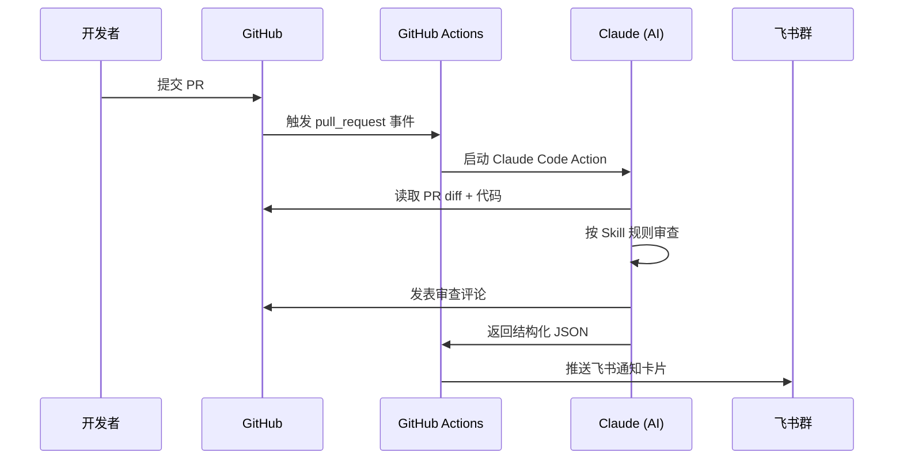

你不需要 @任何人，不需要手动操作，PR 一提就自动跑。

---

## 整体架构

系统分两层：**模板仓库**（提供能力）和 **业务仓库**（使用能力）。

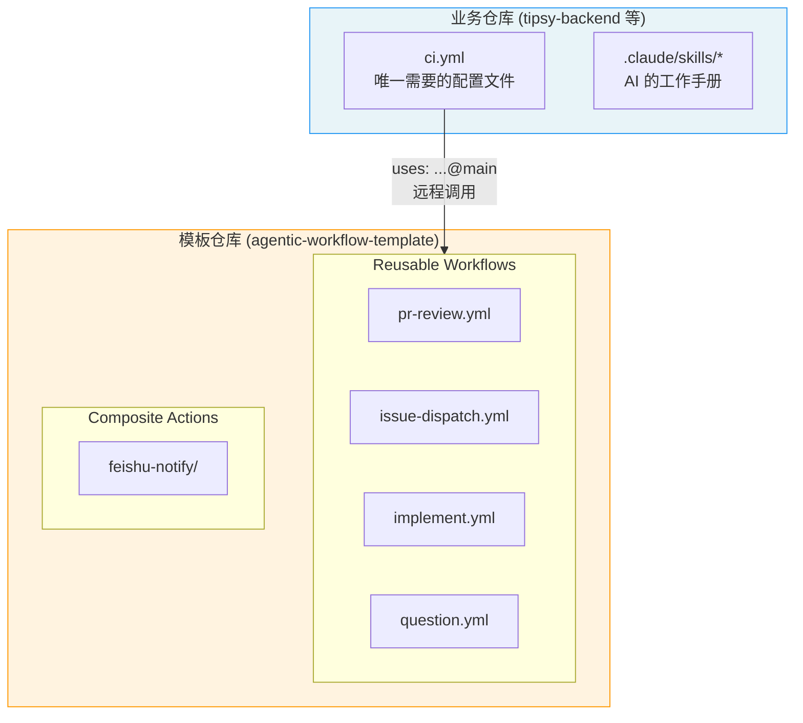

为什么这么拆？因为你不想在每个仓库里都维护一套 workflow。**模板仓库改一次，所有接入的业务仓库立刻生效。**

业务仓库只需要做两件事：
1. 放一个 `ci.yml` 当路由入口
2. 放一套 `.claude/skills/` 告诉 AI 该怎么干活

---

## 事件路由：ci.yml 做了什么

`ci.yml` 是整个系统的入口——**根据 GitHub 事件类型，分发到不同的 workflow**：

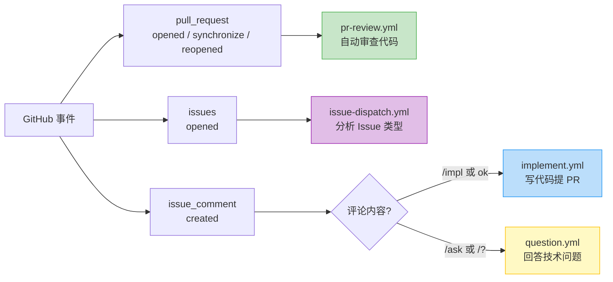

对应的路由逻辑：

```yaml
# PR 事件 → 代码审查
pr-review:
  if: github.event_name == 'pull_request'

# Issue 新建 → 自动分析（Bug? 需求? 问题?）
issue-dispatch:
  if: github.event_name == 'issues'

# Issue 下评论 → 看关键词决定干什么
implement:
  if: github.event_name == 'issue_comment'  # 匹配 /impl, ok 等
question:
  if: github.event_name == 'issue_comment'  # 匹配 /ask, /? 等
```

---

## Code Review 的详细流程

这是本文重点。当一个非 Draft 的 PR 被 opened / synchronize / reopened 时，审查流程启动：

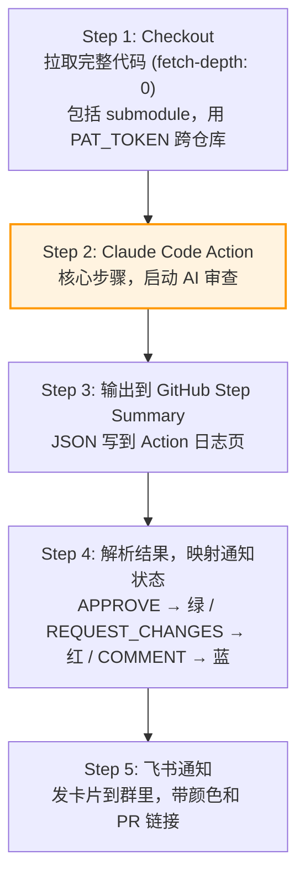

其中 **Step 2** 是 AI 实际干活的地方，内部逻辑如下：

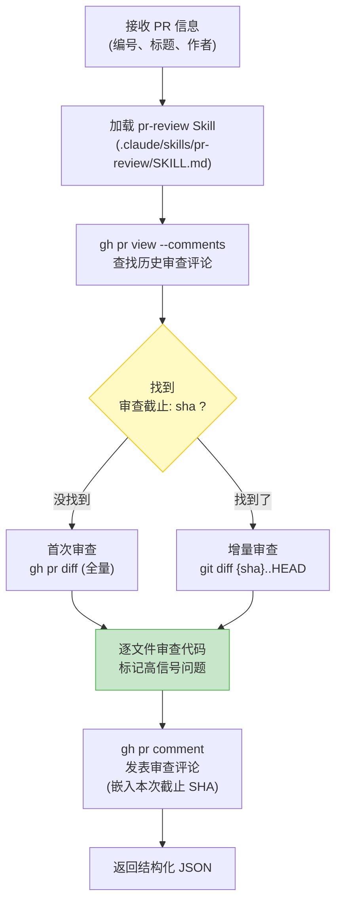

Claude 可以使用的工具有严格的白名单：

| 工具 | 用途 | 权限性质 |
|------|------|----------|
| `gh pr comment` | 发表 PR 评论 | 写（仅评论） |
| `gh pr diff` / `gh pr view` | 查看 PR 信息 | 只读 |
| `Read` / `Glob` / `Grep` | 读取仓库代码 | 只读 |
| `Task` / `Skill` | 调用子能力 | 内部 |

注意：**没给 Write 和 Edit 权限**——审查时 AI 只能看、不能改你的代码。

---

## 增量审查是怎么实现的

这个设计比较巧妙，值得单独讲。

**问题**：一个 PR 可能连续 push 好几次，你不希望每次都从头审一遍。

**方案**：用 PR 评论当"状态存储"——每次审查完在评论里记录一个 commit SHA，下次只 diff 这个 SHA 之后的新改动。

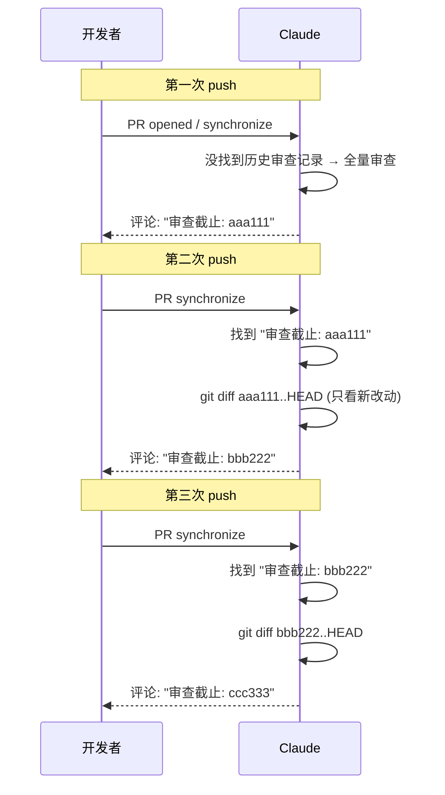

没有额外的数据库、没有外部存储，就靠 PR 评论里的一行文本实现了状态跟踪。简单但有效。

另外，`use_sticky_comment: true` 这个配置保证 Claude 在同一个 PR 里只维护一条评论（更新而非新建），PR 的评论区不会被刷屏。

---

## Skill 系统：AI 的"工作手册"

Claude 不是裸跑的，它的行为受 `.claude/skills/` 目录下的 Markdown 文件约束。你可以把 Skill 理解成给 AI 写的 SOP（标准作业流程）。

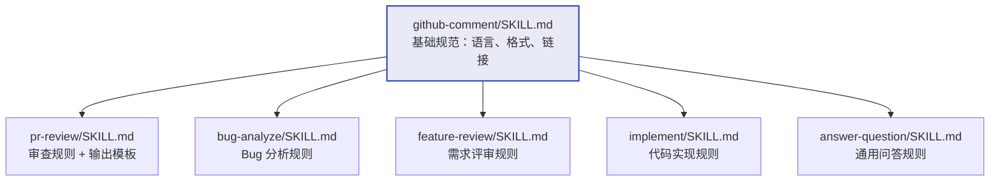

以 `pr-review` Skill 为例，它规定了几件事：

**该标记的（高信号问题）：**
- 语法错误、类型错误、缺少 import
- 不管输入是什么都一定会出错的逻辑 bug
- 违反了某个明确规范（且能引用该规范）

**不该标记的（误报来源）：**
- PR 改动前就存在的老问题
- "有可能出问题"但需要特定条件才会触发的
- 主观的"我觉得这样写更好"
- Linter 已经能抓的

一句话原则：**拿不准就别标。误报一多，大家就不看了。**

输出模板也是固定的——三级问题用折叠块展示：

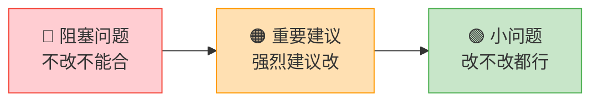

---

## 结构化输出：JSON 驱动下游

Claude 的审查结果不只是一段评论文本，还有一份结构化 JSON：

```json
{
  "conclusion": "APPROVE",
  "description": "代码良好，发现2个小问题",
  "critical_count": 0,
  "important_count": 1,
  "suggestion_count": 2
}
```

这个 JSON 通过 `--json-schema` 参数在调用时约束，Claude 必须按格式输出。有了结构化数据，后续的通知和状态判断都能自动处理，不用去解析自然语言。

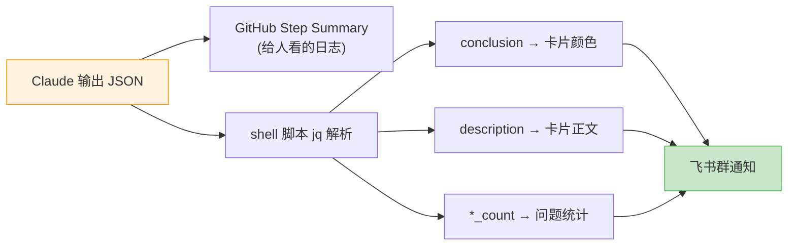

---

## 飞书通知

飞书通知用一个 Composite Action（`feishu-notify`）封装，所有 workflow 共用。它干的事很简单——根据状态拼一张飞书卡片 JSON，curl 发到 Webhook：

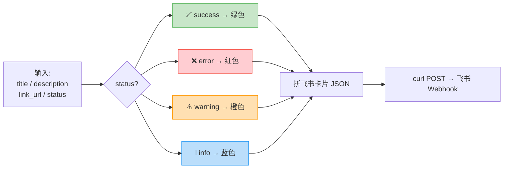

---

## 权限和安全

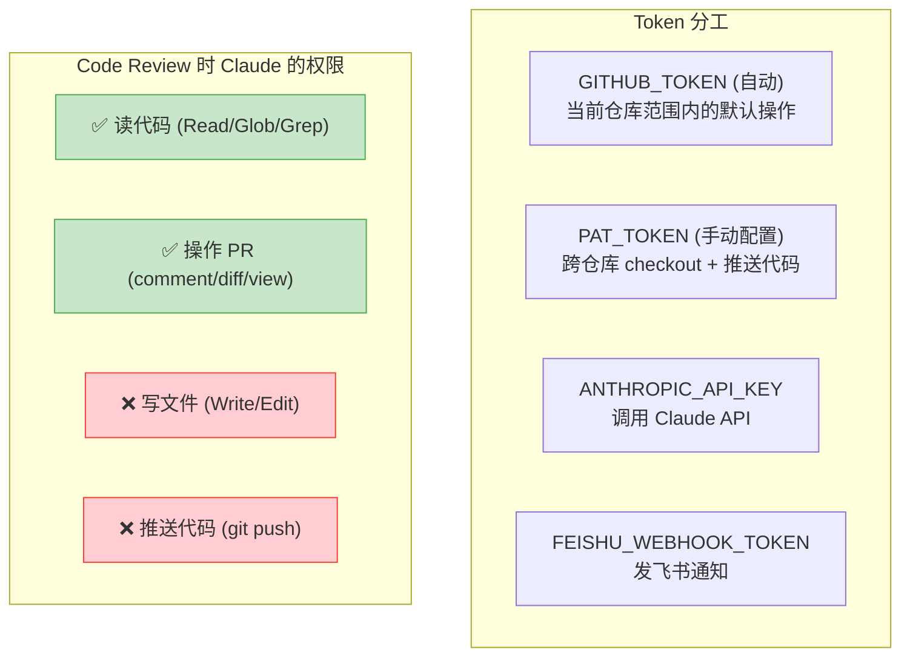

**审查时 AI 是只读的**，不可能意外改动你的代码。

---

## 新仓库接入清单

给一个新仓库接入这套能力，只需要三步：

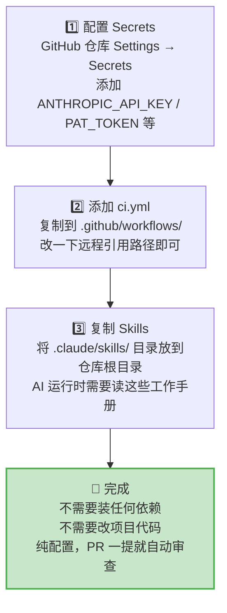

---

## 不只是 Code Review

虽然本文聚焦 Code Review，但同一套架构还支撑了其他几个能力：

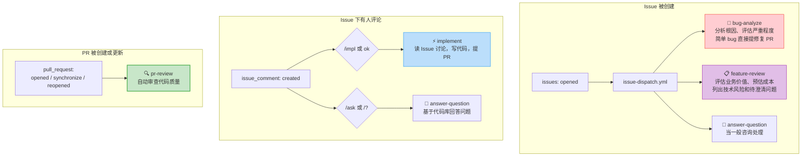

---

## 总结

几个关键的设计决策：

- **模板仓库 + Reusable Workflow** — 改一处，全局生效，多仓库接入成本极低
- **Skill = Markdown SOP** — AI 的行为规则以 Markdown 定义，任何人都能读懂和修改
- **评论里存状态** — 增量审查不需要外部存储，靠 commit SHA 串联上下文
- **结构化输出** — JSON Schema 让 AI 的结果可编程，驱动通知和统计
- **最小权限** — 审查时 AI 只能读、不能写，避免意外修改
- **高信号策略** — 宁可漏报也不误报，维护团队对自动审查的信任
